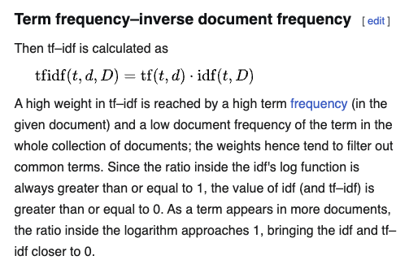
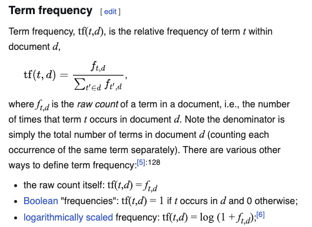
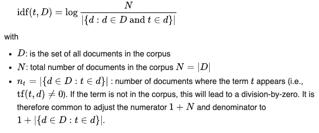

# Blogs-Recommender-System

This project builds a **multi-level hybrid blog recommendation system** using a combination of popularity-based, content-based, collaborative filtering approaches. It is based on three main datasets: author information, blog metadata, and user-blog interaction (ratings).

---

## 🗂️ Datasets Used

- `authors_df`: Contains `author_id`, `author_name`
- `blogs_df`: Contains blog metadata like `blog_id`, `author_id`, `blog_title`, `blog_content`, `topic`, `scrape_time`, etc.
- `blogs_rating_df`: Contains `userId`, `blog_id`, and `ratings` with values:
  - `0.5`: User has just read the blog
  - `2`: User liked the blog
  - `3.5`: User favorited the blog
  - `5`: User both liked and favorited

---

## 🧱 Recommendation System Levels

### 🔹 Level 1 – Simple Heuristic Models

#### ✅ Popularity-Based Recommender
- Recommends blogs with the highest average rating or number of interactions.
- Interprets ratings to weight engagement (e.g., 5 means high interest).
- Can use weighted rating formula (e.g., IMDB style).

#### ✅ Topic-Based Recommender
- Assigns blogs to dominant topics using manual or LDA topic labels.
- Recommends most popular blogs within a user-preferred topic.
- Can use weighted ratings within each topic.

---

### 🔹 Level 2 – Collaborative Filtering

#### Content-Based Recommendation (TF-IDF)

#### ✅ A TF-IDF-based recommender analyzes the textual content of blogs (e.g., title, body) to find similarity. It recommends blogs similar to those a user already liked, based on content — not on other users' opinions.





[Wikipedia - TFIDF](https://en.wikipedia.org/wiki/Tf%E2%80%93idf)

- For each blog, it creates a vector using Term Frequency–Inverse Document Frequency, giving importance to unique but informative words.
- For a specific user, take all blogs they rated highly.
- Measure cosine similarity between the user's interest profile and all other blog vectors.


#### ✅ User-User Collaborative Filtering
- Finds users similar to a target user based on blog rating patterns.
- Recommends blogs liked by similar users.
- Uses KNN on user-blog interaction matrix.

#### ✅ Item-Item Collaborative Filtering
- Finds blogs similar to ones a user liked.
- Recommends blogs with similar rating patterns.
- More stable in sparse data than user-user CF.

#### ✅ Cold Start Scenarios
When a recommender doesn’t have enough information to make accurate predictions for:
- Cold Start User – New user with no prior ratings.
- Solution: Recommend blogs based on similar topics/titles from the interaction/s made.
- Cold Start Blog – New blog with no ratings yet.
- Solution:  New blog will show up as a candidate if its content is similar to what users like, even before anyone rates it.
---

### 🔹 Level 3 – Matrix Factorization

#### ✅ SVD using Surprise
- Factorizes user-blog matrix into latent vectors.
- Predicts missing ratings using dot product of user/item vectors.
- Requires `surprise` library and dense ratings matrix.

#### ✅ BPR (Bayesian Personalized Ranking)
- Learns user preferences using pairwise ranking.
- Trains on `(user, positive_item, negative_item)` triples.
- Implemented using the `implicit` library and CSR matrix.

---

### 🔹 Level 4 – Content + Topic Modeling

#### ✅ TF-IDF Based Content Recommender
- Computes TF-IDF vectors from blog title and content.
- Finds cosine similarity between user-liked blogs and unseen ones.
- Recommends based on textual similarity.

#### ✅ LDA Topic Modeling
- Extracts latent topics from blog content using Gensim.
- Assigns each blog a topic distribution.
- Can cluster or recommend blogs within similar topic distributions.

---

## 🧹 Preprocessing Highlights

- Cleaned `author_name`: removed special chars, converted to CamelCase, split multiple authors.
- Filtered non-English names and blogs with missing fields.
- Applied `nltk` stopwords and custom stopwords for LDA topic modeling.
- Cleaned blog content using tokenization, punctuation filtering, and normalization.

---

## 📊 Visualizations

- Bar plot of blog rating distribution using Plotly
- Box plot of topic frequency
- LDA topic-word display
- t-SNE or clustering plots (optional)

---

## 🧠 Key Learnings

- Not all algorithms work equally well on all problem types.
- Collaborative filtering performs poorly in cold-start cases.
- Content-based and topic modeling can address cold-start issues.
- BPR is powerful for implicit feedback but harder to interpret.
- Topic-based recommendations can be semantically rich and user-friendly.

---

## 🔧 Future Enhancements

- Streamlit UI for interactive recommendations
- Hybrid recommender (collaborative + content)
- Model monitoring & feedback loop
- Personalized topic filtering
- Deployment via Docker/Heroku

---

## 📁 Folder Structure (Suggested)

```
.
├── data/
│   ├── authors.csv
│   ├── blogs.csv
│   └── ratings.csv
├── notebooks/
│   ├── level1_popularity_topic.ipynb
│   ├── level2_collaborative.ipynb
│   ├── level3_matrix_factorization.ipynb
│   └── level4_topic_modeling.ipynb
├── scripts/
│   ├── preprocessing.py
│   └── recommenders.py
├── README.md
└── requirements.txt
```

---

## 📦 Requirements

Install with:

```bash
pip install -r requirements.txt
```

Dependencies include:
- pandas, numpy, scikit-learn
- gensim, nltk
- surprise, implicit
- matplotlib, seaborn, plotly

---

## ✍️ Author

Developed as a multi-stage recommender system project for blog suggestions using hybrid techniques.

---